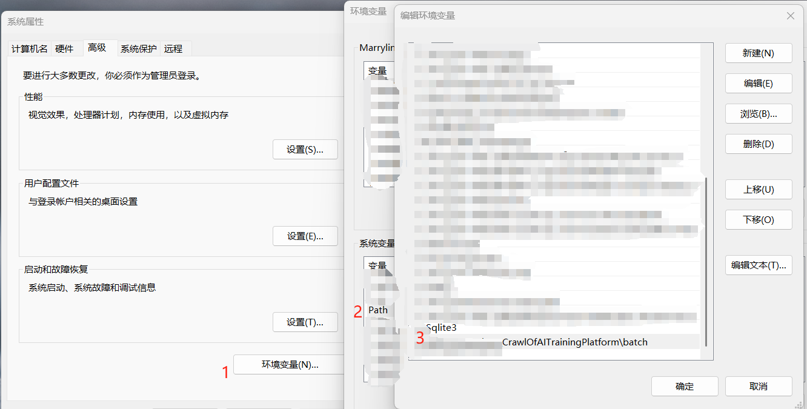

# Crawler for a University AI Training Platform in Hebei

## Declaration of the Project

- **This project is intended solely for research and study purposes. Please ensure that you comply with the laws and
  regulations of your country or region when using this project.**

- **The author bears no responsibility for any unforeseen criminal activities that may arise from violations of this
  declaration. The author does not intend to infringe upon the interests of any relevant organizations, and this project
  will be removed promptly if necessary.**

## Main features of this project contains

- Simulating the login process of the training platform to get the token.
- Simulating the process of getting the tasks list.
- Simulating the process of startup and shutdown.
- Keepalive Function, which means it can do task-wise start to extend release time.
- Check task status.

**TODO:**

- [ ] **Reduce the query frequency and improve the efficiency of program operation.**

## How to use

### Installation

- #### SQLite3
    - Download the SQLite3 from [Here](https://www.sqlite.org/download.html), the most common choice is both
      of [sqlite-dll-win-x64-3460100.zip](https://www.sqlite.org/download.html#:~:text=sqlite%2Ddll%2Dwin%2Dx64%2D3460100.zip)
      and [sqlite-tools-win-x64-3460100.zip](https://www.sqlite.org/2024/sqlite-tools-win-x64-3460100.zip).
      
    - Add the path of the SQLite3 to the environment variable.
- #### Python
    - If you want to compile the project by yourself, I recommend you to use **Python 3.9**.

### Add Environment Variables

- Under Windows OS, open the OS environment settings and add the `./batch` folder into it.
- **PAY ATTENTION**: The path should be the absolute path of the `./batch` folder.
- Both this step and the above step adding the path of SQLite3 to the OS environment can follow this way:
  
### Run

- Open Terminal under Windows 11 or any terminal and run as following command:

  **At the first time**, you should run like this to install the dependencies based on `./requirements.txt`:
    ```shell
    opgpum -r
    ```

- There are some options you can use.:
  - `-r`, `--requirements`: Install the dependencies based on `./requirements.txt`
  - `-a`, `-all`: Choose all. This CAN NOT use with -da, -dt, -du, -ka
  - `-s`, `--shutdown`: Shutdown the task
  - `-c`, `--check`: Check the status of the task
  - `-ka`, `--keepalive`: delay the task release time
  - `-d`, `--default_all`: Run the project using the default user and task
  - `-du`, `--default_user`: Run the project using the default user
  - `-dt`, `--default_task`: Run the project using the default task
- **What's more**, if you do not specific `-s` and the task you want to use, the program will start
  this task before building ssh port forwarding.
